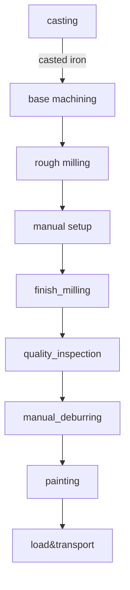

# Goimek

The use case is the production of a piece of the Soraluce machine

They use cast iron 

```mermaid
flowchart TD
    casting--casted iron-->base_machining
    base_machining[base machining]-->rough_milling[rough milling]
    rough_milling-->manual_setup[manual setup]
    manual_setup-->finish_milling
    finish_milling-->quality_inspection
    quality_inspection-->manual_deburring
    manual_deburring-->painting
    painting-->load&transport
```