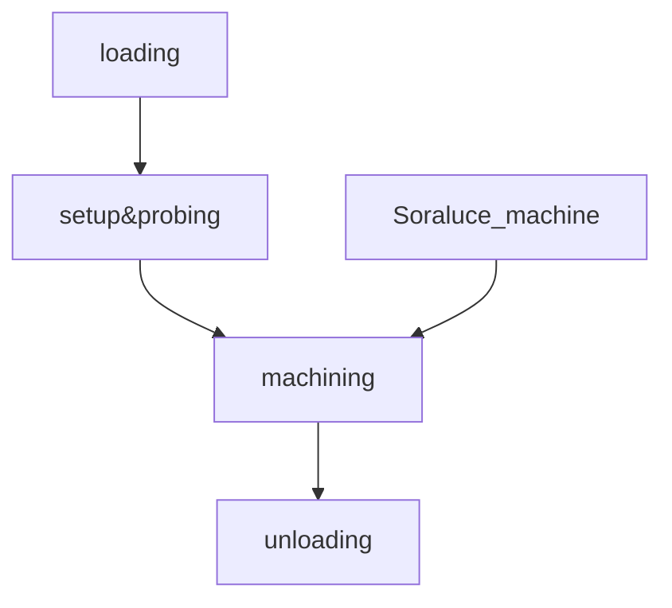

# Komatsu use case

this is how Komatsu describes it, but from our perspective probably the machining is the only one that is relevant.

46 operations

```mermaid
flowchart TD
	loading-->setup&probing
	setup&probing-->machining
	Soraluce_machine-->machining
	machining-->unloading	
```
