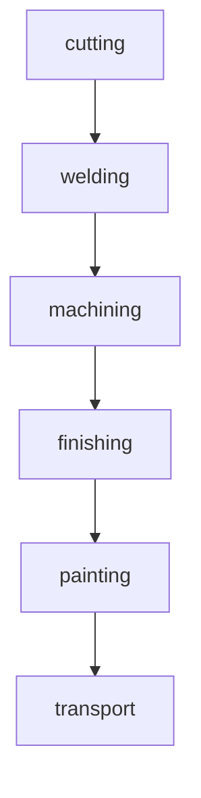

# WWR use case

It produces a _tapped plate_, part of a casting/deburring machine used in the automotive industry.

```mermaid
flowchart TD
    cutting-->welding
    welding-->machining
    machining-->finishing
    finishing-->painting
    painting-->transport
```