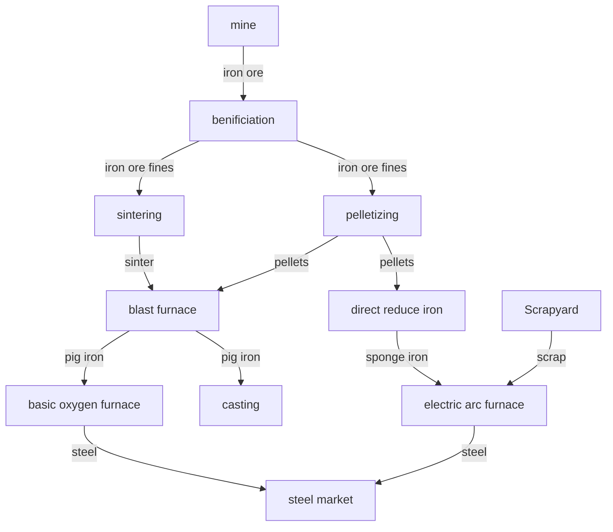

# additional inventories

```mermaid
flowchart TD
	%% direct route
	mine--iron ore-->benificiation
	benificiation--iron ore fines-->sintering
	benificiation--iron ore fines-->pelletizing
	sintering--sinter-->BF[blast furnace]
	pelletizing--pellets-->BF
	BF--pig iron-->BOF[basic oxygen furnace]
	%% dry route
	pelletizing--pellets-->DRI[direct reduce iron]
	DRI--sponge iron-->EAF[electric arc furnace]
	%% recycling route
	Scrapyard--scrap-->EAF
    EAF--steel-->steel_market[steel market]
    BOF--steel-->steel_market
    %% cast iron
    BF--pig iron-->casting
```